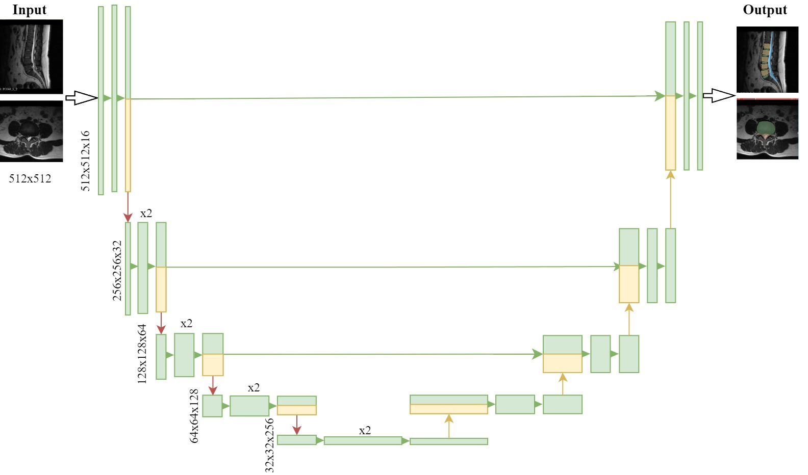
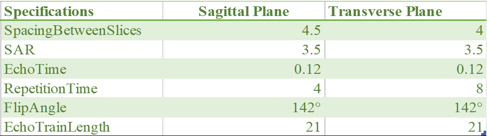
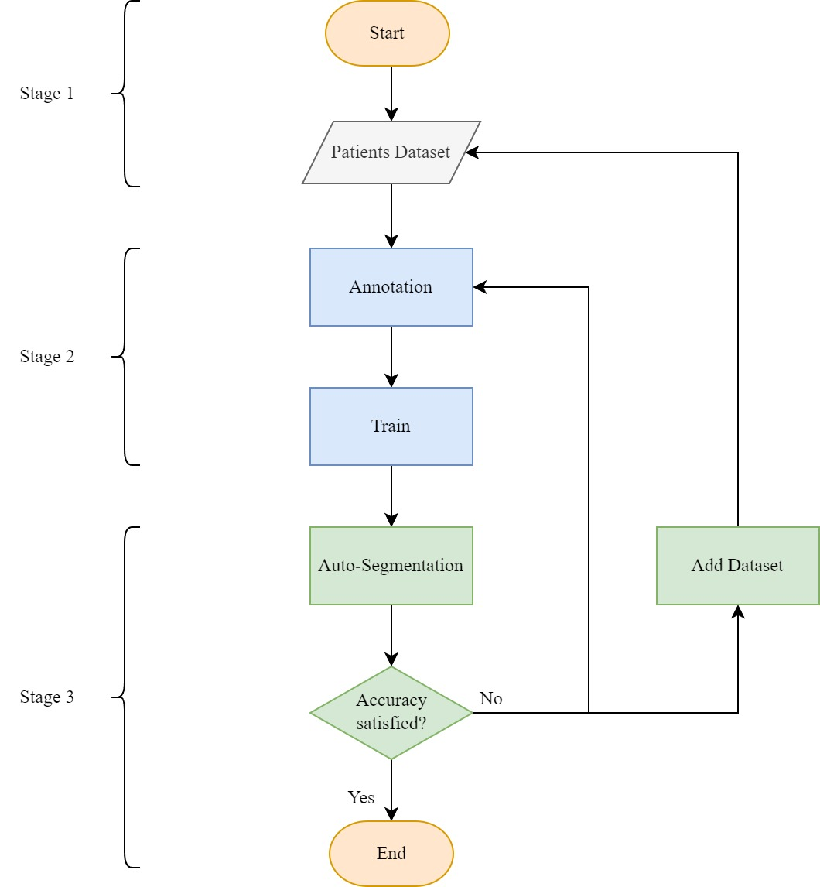
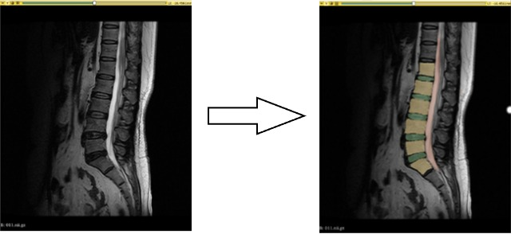
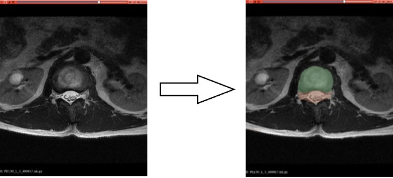
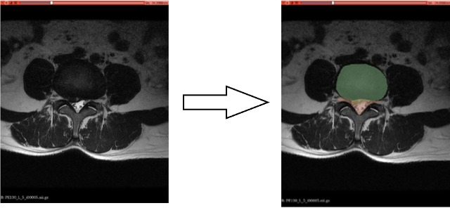

# **Applying MONAI to Assist in the Diagnosis of Lumbar Disc Herniation**

## **Key Investigators**

Lejian Huang (Northwestern University, Chicago, IL, USA)

Binbin Wu (Wenzhou Medical University, Wenzhou, Zhejiang, China)

Yongsheng Huang (University of Wisconsin - Madison, WI, USA)

Weiqian Zhi (University of Wisconsin - Madison, WI, USA)

Lili Yang (Ruijin Hospital, Shanghai Jiao Tong University, Shanghai, China)

## **Objective**

The primary object of this project is to enhance the diagnostic accuracy and quantification of lumbar disc herniation (LDH) by leveraging a state-of-the-art medical AI tool, MONAI, for the analysis of MRI images. Our aim is to achieve a heightened level of precision in automatically identifying and segmenting crucial disc herniations through the integration of human labeling. We will particularly focus on two pivotal anatomical planes: the sagittal and transverse views. Furthermore, in close collaboration with medical specialists, our objective is to develop a robust model for quantifying the extent of LDH. Subsequently, we plan to explore the correlation between the identified extent and the level of pain experienced by the patient. We anticipate that this interdisciplinary approach will not only refine diagnostic processes but also contribute valuable insights into the relationship between the anatomical manifestation of LDH and its associated clinical symptoms.

This project is structured in two distinct stages. Initially, we employ the robust capabilities of MONAI Label to effectively segment lumbar disc (LD) MRI images. Subsequently, our focus shifts to the development of a statistical model designed to quantify the extent of LDH. This sequential approach ensures a comprehensive analysis, encompassing both accurate segmentation and a quantitative understanding of the severity of LDH.

## **Models Overview**

Derived from the _segmentation\_vertebra.py_ pipeline of a SegResNet-based model within MONAI Label [1], our Unet-based models (depicted in **Fig. 1** ) were adapted for training MRI images to accurately segment the spine structure. Given the necessity to address both herniated and healthy lumbar discs (LD) presented in both sagittal and transverse planes, we developed four distinct versions of our models.

  

##### 
Figure 1. The structure of UNet

## **Data**

We recruited 146 patients experiencing chronic pain lasting a minimum of 12 weeks, all diagnosed with LDH through thorough examination of medical history, physical assessment, and independent confirmation via consistent MRI evaluation by two radiologists. Each subject underwent dual scans, both pre and post-surgery, conducted using a 3 Tesla GE-Discovery 750 scanner.

### **Scanner Specifications**

  

### **Preprocessing**

1. Transformed image format from DICOM to NIFTI utilizing bash script.
2. Classified 146 images into herniated or healthy groups in both sagittal and transverse planes, selecting 34 images randomly to form our primary dataset for training models.

## **Training Configurations**

### **Environments**

1. GPU: RTX 4090 24GB | RTX 3070 8GB
2. OS: Windows 11
3. Others: CUDA, Pytorch-GPU, Anaconda

### **Input**

One channel - MRI image

### **Output**

Sagittal Plane:

1. Herniated: Four channels - Label 1: Intervertebral Disk - Label 2: Vertebrae - Label 3: Cerebrospinal fluid 4: Herniated area
2. Healthy: Three channels - Label 1: Intervertebral Disk - Label 2: Vertebrae - Label 3: Cerebrospinal fluid

Transverse Plane:

1. Herniated: Three channels - Label 1: Vertebrae - Label 2: Cerebrospinal fluid - Label 3: Herniated area
2. Healthy: Two channels - Label 1: Vertebrae - Label 2: Cerebrospinal fluid

## **Model Diagram**

  

##### 
Figure 2. The training process of a model

### **Stage 1: Data Conversion and Preparation**

The data format was converted from DICOM to NIfTI to ensure compatibility with the loading requirements of 3D-Slicer.

### **Stage 2: Annotation and Models Training**

1. Compiled the Unet-based pipeline and implemented the MONAI Label server to facilitate training the network.
2. Conducted annotations through human labeling, adhering to the settings and labels outlined in the Unet-based pipeline. Furthermore, annotations were fine-tuned based on the specific LD plane input, whether sagittal or transverse.
3. Configured the network training by setting parameters such as epoch and split-value, and proceeded with the training process

### **Stage 3: Model Development and Refinement**

After conducting automatic inference to obtain intervertebral disk, vertebrae, cerebrospinal fluid, and herniated area using the trained UNet network, the model underwent iterative refinement until reaching satisfactory accuracy. This process involved submitting refined annotations and/or expanding the training datasets to fine-tune the model.

## **Results**

We developed four distinct models corresponding to the herniated and healthy groups in both sagittal and transverse planes. This decision was informed by our observation that the accuracy achieved through individualized models for each scenario outperformed the accuracy obtained from a single model encompassing all four scenarios.

### **Sagittal plane**

##### **Fig. 3** illustrates the segmentation results achieved with an accuracy of 84%, based on the analysis of 34 subjects after 50 training epochs.

##### 
Figure 3

### **Transverse plane**

**Fig. 4** depict the segmentation and localization of intervertebral discs and cerebrospinal fluid in a healthy lumbar disc.

##### 
Figure 4

Likewise, as illustrated in **Fig. 5** , when applied to the transverse plane of a herniated lumbar disc, the model demonstrated its capability to accurately segment intervertebral discs, cerebrospinal fluid, and the herniated area.

##### 
Figure 5

In summary, through the customization and adjustment of parameters, coupled with the expertise of human labeling, our models have developed the capability to effectively and accurately perform auto-segmentation, specifically identifying herniated lumbar discs.

(in progress……)

## **References**

[1] Project-MONAI. (n.d.). Project-Monai/Monailabel: Monai label is an intelligent open source image labeling and learning tool. GitHub. https://github.com/Project-MONAI/MONAILabel/

[2] Ronneberger, O. (2015, May 18). U-NET: Convolutional Networks for Biomedical Image Segmentation. arXiv.org. https://arxiv.org/abs/1505.04597
